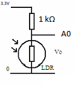
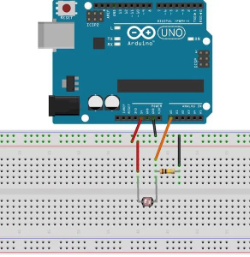

# Light Intensity using LDR in Lux
## Microcontroller: Arduino Uno development board
## Programming Language: C
## Hardware setup:  
  1. Connect one LDR pin to +5V
  2. Connect the other pin to Arduino Ground
  3. Connect 1k ohm Resistor to LDR
  4. Connect the LDR pin connected to +3.3V to A0

## Description:

  1. A program to calculate the intensity of light using Light Dependent Resistor(LDR)
  2. Formula:
     > lux = (512000 / LDRvalue) - 500;
  3. Can be used for light based projects.
